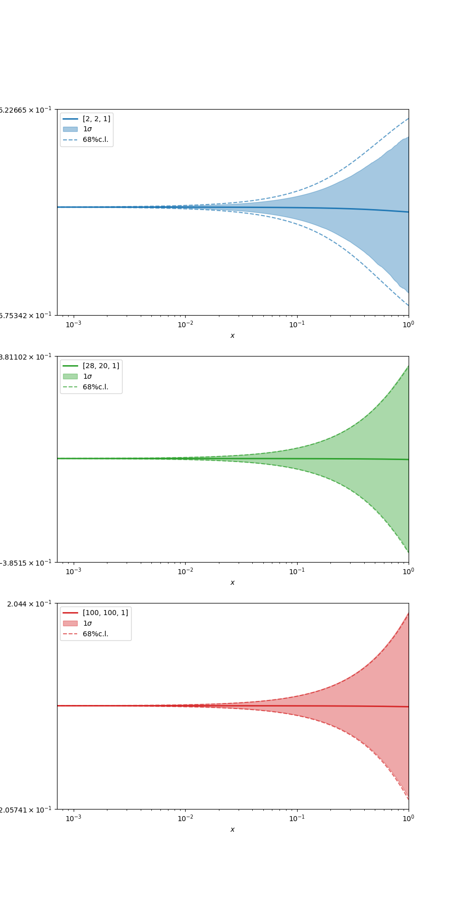

# Results and discussion

The jupyter notebook `prior.ipynb` plots the functional prior induced by the neural network at initialisation. The prior is shown with mean value and uncertainty bands, both computed using the empirical statistics of the ensemble.

The weights in each layer are initialised using `GlorotNormal`, while the biases are initialised to zero. The activation function for all layers is Tanh, except for the last layer (output) which is linear. As seed is also used to reproduce all the initialised parameters and the results. Note that different initialisations are possible, provided that the function that creates the model is modified.

## Plot as function of the architecture
The following plots show the network output as function of the input with central value (thick line) and uncertainty bands corresponding to the 1-$\sigma$ interval (coloured area) and the 68% confidence level (dashed line).

  

